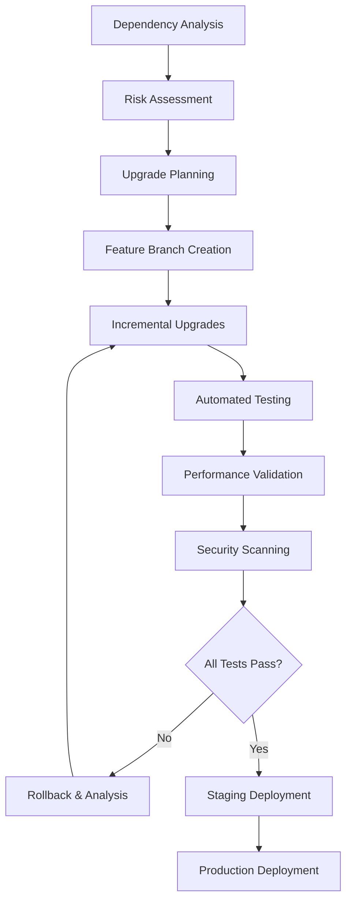
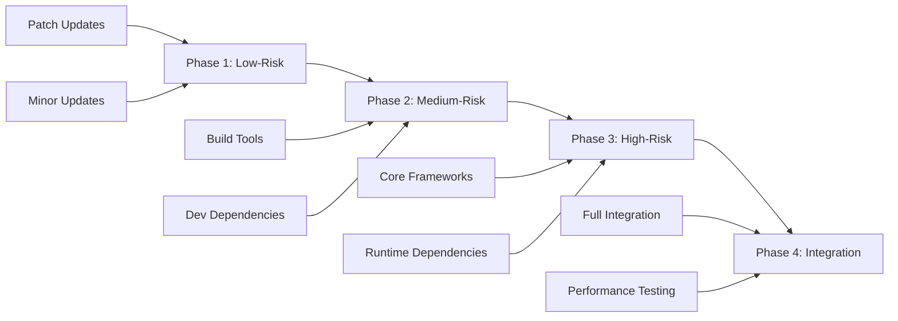
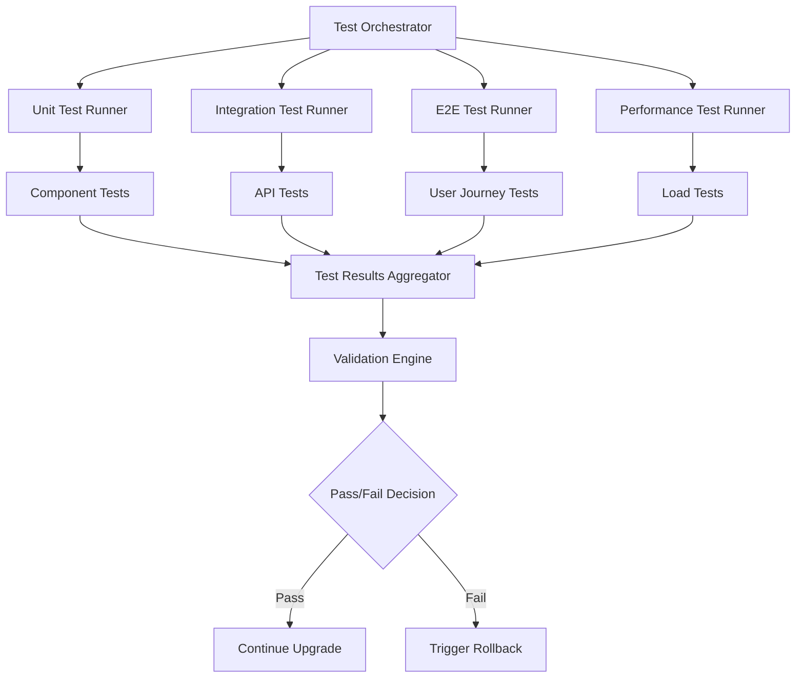

# Design Document - Dependency Upgrade Initiative v1.1.0

## Overview

The Dependency Upgrade Initiative v1.1.0 implements a systematic, risk-managed approach to upgrading major dependencies that were deferred during the v1.0.0 release. The design prioritizes system stability through incremental upgrades, comprehensive testing, and automated rollback capabilities.

This initiative addresses 20+ major dependency upgrades across both backend Python and frontend JavaScript ecosystems, with a focus on maintaining backward compatibility while leveraging new features and security improvements.

## Architecture

### Upgrade Strategy Architecture

The upgrade process follows a multi-phase architecture designed to minimize risk and maximize reliability:



### Phased Rollout Architecture



## Components and Interfaces

### 1. Dependency Management Component

**Purpose**: Centralized management of dependency upgrades with version tracking and compatibility validation.

**Interface**:
```python
class DependencyManager:
    def analyze_dependencies(self) -> DependencyReport
    def plan_upgrade_sequence(self, dependencies: List[Dependency]) -> UpgradePlan
    def validate_compatibility(self, plan: UpgradePlan) -> CompatibilityReport
    def execute_upgrade(self, upgrade: UpgradeStep) -> UpgradeResult
```

### 2. Testing Orchestrator Component

**Purpose**: Coordinates comprehensive testing across all upgrade phases with automated validation.

**Interface**:
```python
class TestingOrchestrator:
    def run_unit_tests(self) -> TestResults
    def run_integration_tests(self) -> TestResults
    def run_performance_tests(self) -> PerformanceResults
    def run_security_tests(self) -> SecurityResults
    def validate_upgrade(self, results: List[TestResults]) -> ValidationResult
```### 3. 
Migration Engine Component

**Purpose**: Handles automated migration of configuration, code, and data structures when breaking changes occur.

**Interface**:
```python
class MigrationEngine:
    def detect_breaking_changes(self, upgrade: UpgradeStep) -> List[BreakingChange]
    def generate_migration_scripts(self, changes: List[BreakingChange]) -> List[MigrationScript]
    def execute_migration(self, script: MigrationScript) -> MigrationResult
    def rollback_migration(self, script: MigrationScript) -> RollbackResult
```

### 4. Monitoring and Alerting Component

**Purpose**: Provides real-time monitoring of upgrade progress and system health with automated alerting.

**Interface**:
```python
class UpgradeMonitor:
    def track_upgrade_progress(self, upgrade_id: str) -> ProgressReport
    def monitor_system_health(self) -> HealthReport
    def detect_anomalies(self, metrics: SystemMetrics) -> List[Anomaly]
    def trigger_rollback(self, reason: str) -> RollbackTrigger
```

## Data Models

### Dependency Model
```python
@dataclass
class Dependency:
    name: str
    current_version: str
    target_version: str
    ecosystem: str  # 'python' | 'javascript'
    risk_level: str  # 'low' | 'medium' | 'high'
    breaking_changes: List[BreakingChange]
    dependencies: List[str]  # Dependent packages
```

### Upgrade Plan Model
```python
@dataclass
class UpgradePlan:
    id: str
    dependencies: List[Dependency]
    phases: List[UpgradePhase]
    estimated_duration: timedelta
    rollback_strategy: RollbackStrategy
    success_criteria: List[SuccessCriterion]
```

### Test Results Model
```python
@dataclass
class TestResults:
    test_type: str
    status: str  # 'passed' | 'failed' | 'skipped'
    execution_time: float
    coverage_percentage: float
    failures: List[TestFailure]
    performance_metrics: Dict[str, float]
```

## Error Handling

### Upgrade Failure Recovery
1. **Automatic Rollback**: When critical tests fail, automatic rollback to previous stable state
2. **Partial Rollback**: Ability to rollback individual dependencies while preserving others
3. **State Preservation**: Maintain system state during rollback operations
4. **Failure Analysis**: Automated collection of failure data for root cause analysis

### Compatibility Issues
1. **Breaking Change Detection**: Automated scanning for API and configuration changes
2. **Migration Generation**: Automatic generation of migration scripts where possible
3. **Manual Intervention Points**: Clear escalation paths for complex compatibility issues
4. **Fallback Strategies**: Alternative upgrade paths when primary approach fails

## Testing Strategy

### Multi-Layer Testing Approach

#### Layer 1: Unit Testing
- **Scope**: Individual component functionality
- **Coverage**: 95% minimum for upgraded components
- **Automation**: Fully automated with CI/CD integration
- **Performance**: Sub-second execution for rapid feedback

#### Layer 2: Integration Testing
- **Scope**: Component interaction and API compatibility
- **Coverage**: All critical integration points
- **Automation**: Automated with staging environment validation
- **Performance**: Under 5 minutes for complete suite

#### Layer 3: End-to-End Testing
- **Scope**: Complete user workflows and business processes
- **Coverage**: All primary user journeys
- **Automation**: Automated with production-like environment
- **Performance**: Under 15 minutes for complete suite

#### Layer 4: Performance Testing
- **Scope**: System performance under load
- **Coverage**: Critical performance metrics and benchmarks
- **Automation**: Automated with baseline comparison
- **Performance**: Validates no regression in key metrics

### Testing Infrastructure



## Security Considerations

### Vulnerability Management
1. **Security Scanning**: Automated vulnerability scanning for all new dependencies
2. **CVE Monitoring**: Continuous monitoring for new vulnerabilities in upgraded packages
3. **Risk Assessment**: Security risk evaluation for each dependency upgrade
4. **Compliance Validation**: Ensure upgrades maintain security compliance requirements

### Access Control
1. **Upgrade Permissions**: Role-based access control for upgrade operations
2. **Approval Workflows**: Multi-stage approval for high-risk upgrades
3. **Audit Logging**: Complete audit trail of all upgrade activities
4. **Rollback Authorization**: Controlled access to rollback operations

## Performance Optimization

### Upgrade Performance
1. **Parallel Processing**: Concurrent upgrade of independent dependencies
2. **Incremental Updates**: Minimize downtime through incremental deployment
3. **Caching Strategy**: Leverage build caches to reduce upgrade time
4. **Resource Optimization**: Efficient resource utilization during upgrades

### System Performance
1. **Performance Baselines**: Establish performance benchmarks before upgrades
2. **Regression Detection**: Automated detection of performance regressions
3. **Optimization Opportunities**: Identify performance improvements from upgrades
4. **Monitoring Integration**: Real-time performance monitoring during upgrades

## Deployment Strategy

### Blue-Green Deployment
1. **Environment Isolation**: Separate environments for current and upgraded versions
2. **Traffic Switching**: Gradual traffic migration to upgraded environment
3. **Rollback Capability**: Instant rollback through traffic redirection
4. **Validation Gates**: Comprehensive validation before traffic switching

### Feature Flag Integration
1. **Gradual Rollout**: Feature flags for gradual user exposure to upgrades
2. **A/B Testing**: Compare performance between old and new versions
3. **Emergency Switches**: Instant disable capability for problematic upgrades
4. **User Segmentation**: Controlled rollout to specific user groups

## Monitoring and Observability

### Upgrade Monitoring
1. **Progress Tracking**: Real-time visibility into upgrade progress
2. **Health Metrics**: Continuous monitoring of system health during upgrades
3. **Performance Metrics**: Track performance impact of each upgrade
4. **Error Tracking**: Comprehensive error collection and analysis

### Alerting Strategy
1. **Threshold-Based Alerts**: Automated alerts for metric threshold breaches
2. **Anomaly Detection**: Machine learning-based anomaly detection
3. **Escalation Procedures**: Clear escalation paths for different alert types
4. **Communication Channels**: Multi-channel alert distribution