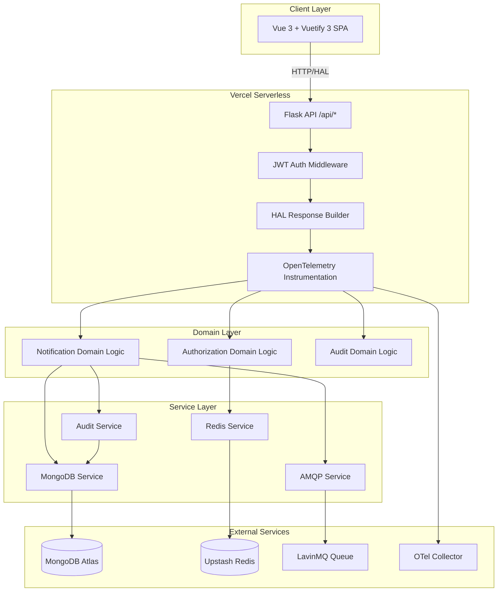
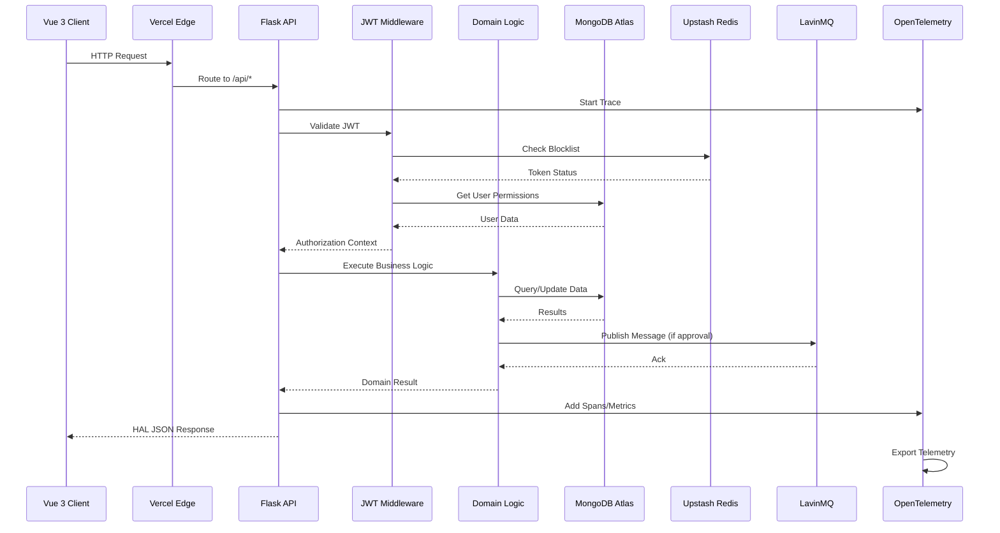

# Design Document

## Overview

S.O.S Cidadão is a serverless, multi-tenant civic notification platform built with a Python Flask backend and Vue 3 frontend. The system enables municipal teams to receive, moderate, and dispatch critical public alerts through an auditable, permission-controlled workflow.

### Key Design Principles

1. **Serverless-First**: Optimized for Vercel serverless functions with stateless request handling
2. **Functional Core, Imperative Shell**: Pure domain logic with side effects at boundaries
3. **Multi-Tenancy by Design**: Organization-scoped data isolation at every layer
4. **Hypermedia-Driven**: HATEOAS Level-3 APIs using HAL for discoverability
5. **Observability-Native**: OpenTelemetry instrumentation throughout
6. **Security by Default**: JWT auth, RBAC, audit logging, and secrets scanning

### Technology Stack

**Backend:**
- Python 3.11+ with Flask
- flask-openapi3 for OpenAPI 3.0 + Pydantic validation
- PyJWT / Flask-JWT-Extended for authentication
- pymongo for MongoDB Atlas
- upstash-redis (HTTP client) for caching and token management
- pika for AMQP (LavinMQ)
- opentelemetry-api and auto-instrumentation

**Frontend:**
- Vue 3 with Composition API
- Vuetify 3 (Material Design 3)
- Vue Router for routing
- Pinia for state management
- Axios for HTTP with HAL response handling

**Infrastructure:**
- Vercel for serverless deployment
- MongoDB Atlas for persistent storage
- Upstash Redis for caching and sessions
- CloudAMQP LavinMQ for message queuing
- Docker Compose for local development

**CI/CD:**
- GitHub Actions
- Redocly CLI for OpenAPI validation
- Codium PR-Agent for AI code review
- Gitleaks for secrets scanning
- Dependabot for dependency updates


## Architecture

### High-Level Architecture Diagram



### Request Flow Architecture



### Layered Architecture

The system follows a clean architecture pattern with clear separation of concerns:

**1. Presentation Layer (Vue 3 Frontend)**
- Vue 3 components with Composition API
- Vuetify 3 Material Design components
- HAL-aware HTTP client for API communication
- Pinia stores for state management
- Vue Router for client-side routing

**2. API Layer (Flask Serverless Functions)**
- Flask routes with flask-openapi3 decorators
- Pydantic models for request/response validation
- HAL response formatting middleware
- JWT authentication and authorization middleware
- OpenTelemetry auto-instrumentation

**3. Domain Layer (Pure Functions)**
- Notification workflow logic (receive → review → approve/deny → dispatch)
- Authorization logic (role/permission aggregation)
- Audit trail generation
- Data transformation and validation
- Business rule enforcement

**4. Service Layer (Side Effects)**
- MongoDB operations (CRUD, queries, transactions)
- Redis operations (caching, JWT blocklist)
- AMQP message publishing
- Audit log persistence
- External API integrations

**5. Infrastructure Layer**
- Database connection management
- Redis connection pooling
- AMQP connection handling
- OpenTelemetry configuration
- Environment-based configuration
##
 Components and Interfaces

### Core Domain Models

**Organization**
```python
@dataclass
class Organization:
    id: str
    name: str
    slug: str
    created_at: datetime
    updated_at: datetime
    deleted_at: Optional[datetime]
    created_by: str
    updated_by: str
    schema_version: int
```

**User**
```python
@dataclass
class User:
    id: str
    organization_id: str
    email: str
    name: str
    password_hash: str
    roles: List[str]  # Role IDs
    permissions: List[str]  # Computed from roles
    created_at: datetime
    updated_at: datetime
    deleted_at: Optional[datetime]
    created_by: str
    updated_by: str
    schema_version: int
```

**Notification**
```python
@dataclass
class Notification:
    id: str
    organization_id: str
    title: str
    body: str
    severity: int  # 0-5
    origin: str
    original_payload: Dict[str, Any]
    base_target: Optional[str]
    targets: List[str]
    categories: List[str]
    status: NotificationStatus  # received|approved|denied|dispatched
    denial_reason: Optional[str]
    created_at: datetime
    updated_at: datetime
    deleted_at: Optional[datetime]
    created_by: str
    updated_by: str
    schema_version: int

class NotificationStatus(Enum):
    RECEIVED = "received"
    APPROVED = "approved"
    DENIED = "denied"
    DISPATCHED = "dispatched"
```

**NotificationTarget**
```python
@dataclass
class NotificationTarget:
    id: str
    organization_id: str
    name: str
    description: str
    parent: Optional[str]
    children: List[str]
    created_at: datetime
    updated_at: datetime
    deleted_at: Optional[datetime]
    created_by: str
    updated_by: str
    schema_version: int
```

**Endpoint**
```python
@dataclass
class Endpoint:
    id: str
    organization_id: str
    name: str
    description: str
    url: str
    data_mapping: Dict[str, Any]  # JSONPath transformations
    notification_categories: List[str]
    created_at: datetime
    updated_at: datetime
    deleted_at: Optional[datetime]
    created_by: str
    updated_by: str
    schema_version: int
```### Se
rvice Interfaces

**MongoDB Service**
```python
class MongoDBService:
    def find_by_org(self, collection: str, org_id: str, filters: Dict = None) -> List[Dict]
    def find_one_by_org(self, collection: str, org_id: str, doc_id: str) -> Optional[Dict]
    def create(self, collection: str, document: Dict) -> str
    def update_by_org(self, collection: str, org_id: str, doc_id: str, updates: Dict) -> bool
    def soft_delete_by_org(self, collection: str, org_id: str, doc_id: str, user_id: str) -> bool
    def paginate_by_org(self, collection: str, org_id: str, page: int, size: int, filters: Dict = None) -> PaginationResult
```

**Redis Service**
```python
class RedisService:
    def set_with_ttl(self, key: str, value: str, ttl_seconds: int) -> bool
    def get(self, key: str) -> Optional[str]
    def delete(self, key: str) -> bool
    def is_token_blocked(self, token_id: str) -> bool
    def block_token(self, token_id: str, ttl_seconds: int) -> bool
    def cache_user_permissions(self, user_id: str, permissions: List[str], ttl_seconds: int) -> bool
    def get_cached_permissions(self, user_id: str) -> Optional[List[str]]
```

**AMQP Service**
```python
class AMQPService:
    def publish_notification(self, exchange: str, routing_key: str, message: Dict, correlation_id: str) -> bool
    def setup_exchanges_and_queues(self, config: Dict) -> bool
    def transform_payload(self, notification: Notification, data_mapping: Dict) -> Dict
```

**Audit Service**
```python
class AuditService:
    def log_action(self, user_id: str, org_id: str, entity: str, entity_id: str, 
                   action: str, before: Dict, after: Dict, request_context: RequestContext) -> str
    def query_audit_logs(self, org_id: str, filters: AuditFilters, pagination: Pagination) -> PaginationResult
    def export_audit_logs(self, org_id: str, filters: AuditFilters, format: str) -> bytes
```

### Domain Logic Interfaces

**Notification Domain**
```python
def receive_notification(payload: Dict, origin: str, user_context: UserContext, 
                        mongo_svc: MongoDBService, audit_svc: AuditService) -> Result[Notification, Error]:
    """Pure function to process incoming notification webhook"""

def approve_notification(notification_id: str, targets: List[str], categories: List[str],
                        user_context: UserContext, mongo_svc: MongoDBService, 
                        amqp_svc: AMQPService, audit_svc: AuditService) -> Result[Notification, Error]:
    """Pure function to approve and dispatch notification"""

def deny_notification(notification_id: str, reason: str, user_context: UserContext,
                     mongo_svc: MongoDBService, audit_svc: AuditService) -> Result[Notification, Error]:
    """Pure function to deny notification with reason"""

def list_notifications(filters: NotificationFilters, pagination: Pagination,
                      user_context: UserContext, mongo_svc: MongoDBService) -> Result[PaginationResult, Error]:
    """Pure function to list notifications with org scoping"""
```

**Authorization Domain**
```python
def authenticate_user(token: str, redis_svc: RedisService, mongo_svc: MongoDBService) -> Result[UserContext, Error]:
    """Pure function to validate JWT and build user context"""

def check_permission(user_context: UserContext, required_permission: str) -> bool:
    """Pure function to check if user has required permission"""

def aggregate_user_permissions(user_roles: List[Role]) -> List[str]:
    """Pure function to compute effective permissions from roles"""

def generate_hal_links(resource: Dict, user_context: UserContext, base_url: str) -> Dict[str, Any]:
    """Pure function to generate HAL affordance links based on permissions"""
```## 
Data Models

### MongoDB Collections Schema

**organizations**
```json
{
  "_id": "ObjectId",
  "name": "string",
  "slug": "string (unique)",
  "createdAt": "ISODate",
  "updatedAt": "ISODate", 
  "deletedAt": "ISODate | null",
  "createdBy": "string",
  "updatedBy": "string",
  "schemaVersion": "number"
}
```

**users**
```json
{
  "_id": "ObjectId",
  "organizationId": "ObjectId",
  "email": "string (unique per org)",
  "name": "string",
  "passwordHash": "string",
  "roles": ["ObjectId"],
  "createdAt": "ISODate",
  "updatedAt": "ISODate",
  "deletedAt": "ISODate | null", 
  "createdBy": "string",
  "updatedBy": "string",
  "schemaVersion": "number"
}
```

**notifications**
```json
{
  "_id": "ObjectId",
  "organizationId": "ObjectId",
  "title": "string",
  "body": "string",
  "severity": "number (0-5)",
  "origin": "string",
  "originalPayload": "object",
  "baseTarget": "ObjectId | null",
  "targets": ["ObjectId"],
  "categories": ["ObjectId"],
  "status": "string (received|approved|denied|dispatched)",
  "denialReason": "string | null",
  "createdAt": "ISODate",
  "updatedAt": "ISODate",
  "deletedAt": "ISODate | null",
  "createdBy": "string", 
  "updatedBy": "string",
  "schemaVersion": "number"
}
```

**audit_logs**
```json
{
  "_id": "ObjectId",
  "timestamp": "ISODate",
  "userId": "ObjectId",
  "organizationId": "ObjectId", 
  "entity": "string",
  "entityId": "string",
  "action": "string",
  "before": "object | null",
  "after": "object | null",
  "ipAddress": "string",
  "userAgent": "string",
  "traceId": "string",
  "schemaVersion": "number"
}
```

### MongoDB Indexes

**Performance Indexes:**
```javascript
// organizations
db.organizations.createIndex({ "slug": 1 }, { unique: true })
db.organizations.createIndex({ "deletedAt": 1 })

// users  
db.users.createIndex({ "organizationId": 1, "email": 1 }, { unique: true })
db.users.createIndex({ "organizationId": 1, "deletedAt": 1 })

// notifications
db.notifications.createIndex({ "organizationId": 1, "status": 1, "createdAt": -1 })
db.notifications.createIndex({ "organizationId": 1, "deletedAt": 1 })
db.notifications.createIndex({ "organizationId": 1, "severity": 1 })

// audit_logs
db.audit_logs.createIndex({ "organizationId": 1, "timestamp": -1 })
db.audit_logs.createIndex({ "organizationId": 1, "userId": 1, "timestamp": -1 })
db.audit_logs.createIndex({ "organizationId": 1, "entity": 1, "timestamp": -1 })
db.audit_logs.createIndex({ "traceId": 1 })
```

### Redis Key Patterns

**JWT Blocklist:**
```
jwt:blocked:{token_id} -> "1" (TTL = token expiration)
```

**User Permission Cache:**
```
user:permissions:{user_id} -> JSON array of permissions (TTL = 15 minutes)
```

**Notification Counts Cache:**
```
org:{org_id}:notifications:count:{status} -> number (TTL = 5 minutes)
```

**Rate Limiting:**
```
rate_limit:{org_id}:{endpoint}:{window} -> number (TTL = window duration)
```## Err
or Handling

### Error Response Format

All API errors follow RFC 7807 Problem Details format with HAL extensions:

```json
{
  "type": "https://api.sos-cidadao.org/problems/validation-error",
  "title": "Validation Error", 
  "status": 400,
  "detail": "The request body contains invalid data",
  "instance": "/api/notifications/123",
  "errors": [
    {
      "field": "severity",
      "message": "Must be between 0 and 5"
    }
  ],
  "_links": {
    "self": { "href": "/api/notifications/123" },
    "help": { "href": "https://docs.sos-cidadao.org/api/errors#validation" }
  }
}
```

### Error Categories

**Authentication Errors (401)**
- Invalid JWT token
- Expired token
- Blocked/revoked token
- Missing authorization header

**Authorization Errors (403)**
- Insufficient permissions
- Cross-organization access attempt
- Resource not owned by user's organization

**Validation Errors (400)**
- Invalid request body (Pydantic validation)
- Missing required fields
- Invalid field values or formats
- Business rule violations

**Not Found Errors (404)**
- Resource does not exist
- Resource soft-deleted
- Invalid endpoint

**Conflict Errors (409)**
- Duplicate resource creation
- Invalid state transition (e.g., approving already approved notification)

**Server Errors (500)**
- Database connection failures
- Redis unavailable (with graceful degradation)
- AMQP publishing failures
- Unexpected exceptions

### Error Handling Strategy

**Graceful Degradation:**
- Redis unavailable → Skip caching, continue with database
- AMQP unavailable → Log error, mark notification as "approved" for retry
- MongoDB unavailable → Return 503 with retry-after header

**Circuit Breaker Pattern:**
- Implement circuit breakers for external service calls
- Fail fast when services are consistently unavailable
- Automatic recovery when services become available

**Retry Logic:**
- Exponential backoff for transient failures
- Maximum retry attempts with jitter
- Dead letter queues for failed message publishing

**Error Correlation:**
- Include OpenTelemetry trace ID in all error responses
- Log structured error details with trace context
- Enable distributed error tracking across services## 
Testing Strategy

### Testing Pyramid

**Unit Tests (70%)**
- Pure domain functions with no side effects
- Pydantic model validation
- HAL link generation logic
- Data transformation functions
- Authorization logic
- Input validation and sanitization

**Integration Tests (20%)**
- API endpoint tests with test database
- MongoDB service operations
- Redis service operations
- AMQP message publishing
- JWT authentication flows
- HAL response format validation

**End-to-End Tests (10%)**
- Complete notification workflow (receive → approve → dispatch)
- User authentication and authorization flows
- Frontend integration with API
- Multi-tenant data isolation
- Audit trail generation

### Test Environment Setup

**Local Testing:**
```yaml
# docker-compose.test.yml
services:
  mongodb-test:
    image: mongo:7
    environment:
      MONGO_INITDB_DATABASE: sos_cidadao_test
    ports:
      - "27018:27017"
      
  redis-test:
    image: redis:7-alpine
    ports:
      - "6380:6379"
      
  lavinmq-test:
    image: lavinmq/lavinmq:latest
    ports:
      - "5673:5672"
      - "15673:15672"
```

**Test Data Management:**
- Database seeding with realistic test data
- Isolated test organizations for each test suite
- Automatic cleanup between test runs
- Test fixtures for common scenarios

**Mock Services:**
- Mock external API endpoints for integration tests
- Fake AMQP consumer for message verification
- Mock OpenTelemetry collector for observability tests

### Testing Tools and Frameworks

**Backend Testing:**
- pytest for test framework
- pytest-asyncio for async test support
- factory_boy for test data generation
- responses library for HTTP mocking
- testcontainers for integration tests

**Frontend Testing:**
- Vitest for unit tests
- Vue Test Utils for component testing
- Playwright for E2E tests
- MSW (Mock Service Worker) for API mocking

**API Testing:**
- OpenAPI spec validation with spectral
- Contract testing with Pact
- HAL format validation
- Performance testing with locust

### Continuous Testing

**Pre-commit Hooks:**
- Run unit tests on changed files
- Lint code with flake8/eslint
- Format code with black/prettier
- Validate OpenAPI spec

**CI Pipeline Testing:**
- Full test suite on every PR
- Parallel test execution
- Test coverage reporting
- Security vulnerability scanning
- Dependency license checking

**Quality Gates:**
- Minimum 80% code coverage
- All tests must pass
- No security vulnerabilities
- OpenAPI spec validation
- Performance regression detection###
 Security Design

**Authentication & Authorization:**
- JWT tokens with RS256 signing
- Access tokens (15 min TTL) + Refresh tokens (7 day TTL)
- Redis-based token blocklist for immediate revocation
- Role-based permissions with organization scoping
- Password hashing with bcrypt (cost factor 12)

**API Security:**
- HTTPS only (enforced by Vercel)
- CORS configuration for frontend domain
- Rate limiting per organization and endpoint
- Request size limits and timeout controls
- Input validation with Pydantic schemas

**Data Protection:**
- Organization-scoped data isolation
- Soft deletes with audit trails
- PII anonymization in logs
- Encrypted environment variables
- No sensitive data in client-side code

**Infrastructure Security:**
- Secrets stored in Vercel environment variables
- MongoDB Atlas with IP whitelisting and TLS
- Upstash Redis with AUTH and TLS
- CloudAMQP with TLS and user authentication
- Container image vulnerability scanning

### Performance Considerations

**Serverless Optimization:**
- Connection pooling with singleton pattern
- Lazy loading of heavy dependencies
- Minimal cold start footprint
- Efficient JSON serialization
- Cached user permissions in Redis

**Database Performance:**
- Strategic indexing for query patterns
- Pagination for large result sets
- Aggregation pipelines for complex queries
- Connection pooling with appropriate limits
- Query optimization and monitoring

**Caching Strategy:**
- User permissions (15 min TTL)
- Notification counts (5 min TTL)
- Organization metadata (1 hour TTL)
- Static configuration data (24 hour TTL)
- Cache invalidation on data changes

**Frontend Performance:**
- Vue 3 Composition API for optimal reactivity
- Lazy loading of routes and components
- Virtual scrolling for large data tables
- Debounced search and filtering
- Optimistic UI updates with rollback

### Monitoring and Observability

**OpenTelemetry Instrumentation:**
- Automatic HTTP request tracing
- Database query spans with sanitized parameters
- Redis operation spans
- AMQP publishing spans
- Custom business logic spans

**Metrics Collection:**
- Request rate and latency percentiles
- Error rates by endpoint and status code
- Database connection pool metrics
- Cache hit/miss ratios
- Queue message processing metrics

**Logging Strategy:**
- Structured JSON logging
- Correlation IDs for request tracing
- Log levels: DEBUG, INFO, WARN, ERROR
- PII scrubbing in log output
- Centralized log aggregation

**Alerting:**
- High error rates (>5% over 5 minutes)
- Slow response times (>2s p95)
- Database connection failures
- Queue message processing delays
- Security events (failed auth attempts)

### Deployment Architecture

**Vercel Configuration:**
```json
{
  "functions": {
    "api/**/*.py": {
      "runtime": "python3.11"
    }
  },
  "routes": [
    { "src": "/api/(.*)", "dest": "/api/$1" },
    { "src": "/(.*)", "dest": "/index.html" }
  ],
  "env": {
    "MONGODB_URI": "@mongodb-uri",
    "REDIS_URL": "@redis-url", 
    "JWT_SECRET": "@jwt-secret",
    "AMQP_URL": "@amqp-url"
  }
}
```

**Environment Variables:**
- `ENVIRONMENT`: dev|staging|production
- `MONGODB_URI`: MongoDB Atlas connection string
- `REDIS_URL`: Upstash Redis HTTP URL
- `REDIS_TOKEN`: Upstash Redis auth token
- `JWT_SECRET`: RS256 private key for signing
- `JWT_PUBLIC_KEY`: RS256 public key for verification
- `AMQP_URL`: CloudAMQP LavinMQ connection string
- `OTEL_EXPORTER_OTLP_ENDPOINT`: OpenTelemetry collector endpoint
- `DOCS_ENABLED`: Enable/disable API documentation
- `HAL_STRICT`: Enable strict HAL validation

**Scaling Considerations:**
- Vercel automatically scales serverless functions
- MongoDB Atlas auto-scaling for storage and compute
- Upstash Redis with connection pooling
- CloudAMQP queue scaling based on message volume
- CDN caching for static frontend assets