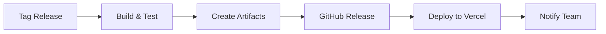

# Release Process Documentation

This document outlines the release process for S.O.S Cidadão.

## 📋 Overview

S.O.S Cidadão follows [Semantic Versioning](https://semver.org/) and uses automated release management with GitHub Actions.

## 🏷️ Version Numbering

### Semantic Versioning Format
```
MAJOR.MINOR.PATCH[-PRERELEASE]
```

- **MAJOR**: Breaking changes, new architecture, incompatible API changes
- **MINOR**: New features, enhancements (backward compatible)
- **PATCH**: Bug fixes, security updates (backward compatible)
- **PRERELEASE**: alpha, beta, rc versions

### Examples
- `1.0.0` - Major release
- `1.1.0` - Minor release with new features
- `1.1.1` - Patch release with bug fixes
- `2.0.0-alpha.1` - Pre-release version
- `2.0.0-beta.2` - Beta version
- `2.0.0-rc.1` - Release candidate

## 🔄 Release Types

### 1. Patch Release (1.0.x)
**When to use**: Bug fixes, security updates, documentation updates

**Process**:
1. Create hotfix branch from main: `git checkout -b hotfix/v1.0.1`
2. Make necessary fixes
3. Update version in relevant files
4. Create PR and merge to main
5. Tag release: `git tag v1.0.1`
6. Push tag: `git push origin v1.0.1`

### 2. Minor Release (1.x.0)
**When to use**: New features, enhancements, non-breaking changes

**Process**:
1. Ensure all features are merged to main
2. Create release branch: `git checkout -b release/v1.1.0`
3. Update version numbers
4. Generate changelog
5. Create PR and merge to main
6. Tag release: `git tag v1.1.0`
7. Push tag: `git push origin v1.1.0`

### 3. Major Release (x.0.0)
**When to use**: Breaking changes, new architecture, major API changes

**Process**:
1. Complete all breaking changes on main
2. Create release branch: `git checkout -b release/v2.0.0`
3. Update version numbers and migration guides
4. Generate comprehensive changelog
5. Create PR and merge to main
6. Tag release: `git tag v2.0.0`
7. Push tag: `git push origin v2.0.0`

### 4. Pre-release (x.y.z-alpha/beta/rc)
**When to use**: Testing new features, getting early feedback

**Process**:
1. Create pre-release branch: `git checkout -b prerelease/v2.0.0-alpha.1`
2. Update version with pre-release identifier
3. Tag and push: `git tag v2.0.0-alpha.1 && git push origin v2.0.0-alpha.1`

## 🤖 Automated Release Workflow

### Trigger Methods

#### 1. Tag-based Release (Recommended)
```bash
# Create and push a tag
git tag v1.0.0
git push origin v1.0.0
```

#### 2. Manual Workflow Dispatch
1. Go to GitHub Actions → Release Management
2. Click "Run workflow"
3. Enter version (e.g., `v1.0.0`)
4. Click "Run workflow"

### Workflow Steps

1. **Validation**: Validates version format and checks requirements
2. **Changelog Generation**: Generates changelog from conventional commits
3. **Build & Test**: Runs full test suite and builds artifacts
4. **Artifact Creation**: Creates OpenAPI specs and source archives
5. **GitHub Release**: Creates GitHub release with notes and assets
6. **Production Deployment**: Deploys to Vercel (for stable releases)
7. **Notification**: Notifies team of release completion

## 📝 Changelog Management

### Automatic Generation
Changelogs are automatically generated from [Conventional Commits](https://conventionalcommits.org/):

```bash
# Install conventional-changelog-cli
npm install -g conventional-changelog-cli

# Generate changelog
conventional-changelog -p angular -i CHANGELOG.md -s
```

### Commit Message Format
```
<type>[optional scope]: <description>

[optional body]

[optional footer(s)]
```

**Types**:
- `feat`: New feature → **Added** section
- `fix`: Bug fix → **Fixed** section
- `docs`: Documentation → **Changed** section
- `style`: Code style → **Changed** section
- `refactor`: Code refactoring → **Changed** section
- `perf`: Performance improvement → **Changed** section
- `test`: Tests → **Changed** section
- `chore`: Maintenance → **Changed** section
- `security`: Security improvement → **Security** section

**Breaking Changes**:
Add `!` after type: `feat!: change API response format`

### Manual Changelog Updates
For complex releases, manually edit `CHANGELOG.md`:

```markdown
## [1.2.0] - 2024-01-15

### Added
- New notification approval workflow
- HAL affordance links for dynamic UI
- OpenTelemetry observability integration

### Changed
- Improved MongoDB connection pooling
- Enhanced error handling in API responses

### Fixed
- Organization scoping in notification queries
- JWT token expiration handling

### Security
- Enhanced JWT token validation
- Added rate limiting for API endpoints
```

## 🏗️ Release Artifacts

### Generated Artifacts

1. **OpenAPI Specification**
   - File: `openapi-{version}.yaml`
   - Versioned API specification
   - Attached to GitHub release

2. **Source Archive**
   - File: `sos-cidadao-{version}-source.tar.gz`
   - Complete source code archive
   - Excludes build artifacts and dependencies

3. **Frontend Build**
   - Built Vue 3 application
   - Deployed to Vercel automatically

### Artifact Storage

- **GitHub Releases**: OpenAPI specs and source archives
- **Vercel**: Frontend deployments
- **Container Registry**: Docker images (if applicable)

## 🚀 Deployment Process

### Environments

1. **Development**: Continuous deployment from main branch
2. **Staging**: Deployment from release branches
3. **Production**: Deployment from tagged releases

### Deployment Pipeline



### Production Deployment

Production deployments are triggered automatically for stable releases (non-prerelease):

1. **Vercel Deployment**: Automatic deployment to production
2. **Health Checks**: Verify deployment health
3. **Rollback**: Automatic rollback on failure

### Rollback Process

If a release needs to be rolled back:

1. **Immediate**: Revert Vercel deployment to previous version
2. **Code Fix**: Create hotfix branch and new patch release
3. **Communication**: Notify users of the issue and resolution

## ✅ Release Checklist

### Pre-Release
- [ ] All features merged to main branch
- [ ] All tests passing
- [ ] Documentation updated
- [ ] Breaking changes documented
- [ ] Migration guides created (for major releases)
- [ ] Security review completed
- [ ] Performance testing completed

### Release Creation
- [ ] Version number follows semantic versioning
- [ ] Changelog generated and reviewed
- [ ] Release notes written
- [ ] Artifacts created and validated
- [ ] GitHub release created
- [ ] Production deployment successful

### Post-Release
- [ ] Deployment health verified
- [ ] Documentation site updated
- [ ] Team notified
- [ ] Social media announcement (for major releases)
- [ ] User communication sent
- [ ] Monitoring alerts configured

## 🔧 Tools and Scripts

### Release Scripts

```bash
# scripts/release.sh
#!/bin/bash
set -e

VERSION=$1
if [ -z "$VERSION" ]; then
    echo "Usage: $0 <version>"
    echo "Example: $0 v1.0.0"
    exit 1
fi

# Validate version format
if [[ ! "$VERSION" =~ ^v[0-9]+\.[0-9]+\.[0-9]+(-[a-zA-Z0-9.-]+)?$ ]]; then
    echo "Invalid version format: $VERSION"
    exit 1
fi

# Create and push tag
git tag "$VERSION"
git push origin "$VERSION"

echo "Release $VERSION initiated. Check GitHub Actions for progress."
```

### Version Update Script

```bash
# scripts/update-version.sh
#!/bin/bash
VERSION=$1

# Update package.json
cd frontend
npm version "$VERSION" --no-git-tag-version

# Update Python version (if applicable)
cd ../api
sed -i "s/version = \".*\"/version = \"$VERSION\"/" pyproject.toml

echo "Version updated to $VERSION"
```

## 📊 Release Metrics

### Key Metrics to Track

- **Release Frequency**: How often releases are made
- **Lead Time**: Time from feature completion to release
- **Deployment Success Rate**: Percentage of successful deployments
- **Rollback Rate**: Percentage of releases requiring rollback
- **Time to Recovery**: Time to fix issues in production

### Monitoring

- **GitHub Actions**: Release workflow success/failure
- **Vercel**: Deployment status and performance
- **Application Monitoring**: Post-deployment health checks
- **User Feedback**: Issues reported after releases

## 🚨 Emergency Releases

### Hotfix Process

For critical security or bug fixes:

1. **Create hotfix branch** from main: `git checkout -b hotfix/critical-fix`
2. **Make minimal fix** addressing the issue
3. **Fast-track testing** focusing on the fix
4. **Create emergency release** following standard process
5. **Deploy immediately** to production
6. **Communicate** to users about the fix

### Security Releases

For security vulnerabilities:

1. **Private development** in security branch
2. **Coordinate disclosure** with security team
3. **Prepare patch** for all supported versions
4. **Release simultaneously** across versions
5. **Security advisory** published with release

## 📞 Support and Communication

### Release Communication

- **GitHub Releases**: Detailed release notes
- **Documentation**: Updated with new features
- **Email**: Notification to subscribers
- **Social Media**: Major release announcements

### Getting Help

- **Release Issues**: Create GitHub issue with `release` label
- **Deployment Problems**: Contact DevOps team
- **Process Questions**: Refer to this documentation

## 📚 References

- [Semantic Versioning](https://semver.org/)
- [Keep a Changelog](https://keepachangelog.com/)
- [Conventional Commits](https://conventionalcommits.org/)
- [GitHub Actions Documentation](https://docs.github.com/en/actions)
- [Vercel Deployment Guide](https://vercel.com/docs)

---

**Last Updated**: December 2024  
**Version**: 1.0  
**Maintained By**: DevOps Team